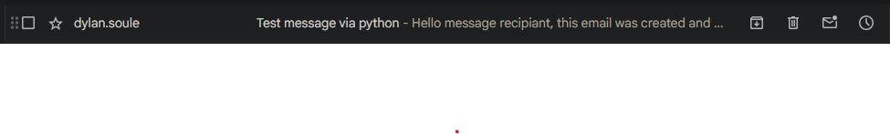

# First Successful email

### Code Write up
---
As a test to understand SMTP better and get a basic understanding the first version is coded in python using smtplib.

While smtplib is very abstracted it does allow for better understanding of email parts and the SMTP protocol from a knowlage base of nothing. For example one of the bigger problems I had was with authenticating and getting email providers, such as apple icloud, to allow you to send an email. I accomplished this through app specific passwords
```python
# Set up credentials (use an Apple App-Specific Password)
sender_email = "example.email@icloud.com" # Replace with actual email
app_password = "xxxx-xxxx-xxxx-xxxx"  # Replace with app-specific password
```
Then when sending the email, not only did I have to make sure I had all the neccessary parts (From, To, Subject, Message), but also authenticating the server request
```python
try:
    with smtplib.SMTP("smtp.mail.me.com", 587) as server:
        server.starttls()
        server.login(sender_email, app_password)
        server.send_message(msg)
        print("Email sent successfully!")
except Exception as e:
    print(f"Error sending email: {e}")
```

### Example usage
---
**Requirements:**
- python 3
- git(to clone the repository)
- email with app password
  - not all emails support app passwords
---
To run clone repo and switch to this specific branch and directory where the file is stored, then fill out the email and app password:
```python
# Set up credentials (use an Apple App-Specific Password)
sender_email = "example.email@icloud.com" # Replace with actual email
app_password = "xxxx-xxxx-xxxx-xxxx"  # Replace with app-specific password
```
If not using an icloud email you will have to update the SMTP server(for example gmail is smtp.gmail.com)
```python
with smtplib.SMTP("smtp.mail.me.com", 587) as server:
```
Then run the script in a terminal
```bash
python smtp.py
```
Which will then prompt you with something like this:
```bash
From: your.email@example.com
To: email.reciever@example.com
Subject: #subject message
Type your email body below (Press Ctrl+D on Mac/Linux or Ctrl+Z then Enter on Windows to send):
# Your email contents
^Z
Email sent successfully!
```

You should then have sent the email if everything went well

### Success!
---
This is my succeessful use case using my script to document that it works
- Executing the python script
```bash
From: dylan.soule@icloud.com
To: 2141247@jeffcoschools.us
Subject: Test message via python
Type your email body below (Press Ctrl+D on Mac/Linux or Ctrl+Z then Enter on Windows to send):
Hello message recipiant, this email was created and sent through python
^Z
Email sent successfully!
```
- Email Recieval Screenshots:




- While the email did send, it also sent with the name dylan.soule, so evidently not all the information that normally gets sent with an email was transfered, in this case speciffically the name